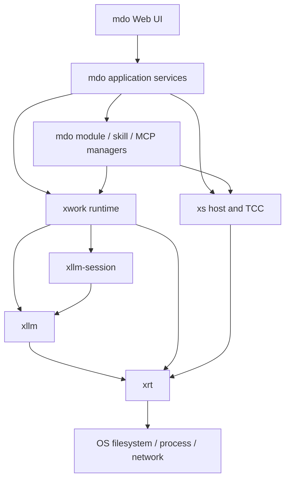

# mdo 重构落地实施计划

> 状态：实施基线（方案已确定）
> 日期：2026-09-21
> 适用仓库：`xrt`、`xserver`、`xrt/extlibs/xllm`、`xrt/extlibs/xllm-session`、`xrt/extlibs/xwork`、`mdo`
> 实施原则：严格按本文阶段门推进；下游不得绕过尚未通过的上游阶段门。

## 1. 文档目的

本文不是愿景清单，而是用于直接组织开发、评审、测试和发布的实施基线。它需要回答以下问题：

- 每一阶段改什么、不改什么；
- API、线程、所有权和错误边界如何定义；
- 哪个仓库是权威来源，如何同步 vendored 副本；
- 哪些测试必须先写，什么结果才允许进入下一阶段；
- 如何从当前 mdo 平滑迁移到单文件、可扩展、可维护的新实现；
- 如何证明开发模式、打包模式、桌面和移动端使用的是同一套语义；
- 出现回归时在哪个层级回滚，而不是在应用层追加兼容补丁。

本文冻结产品与架构方向，具体公开 API 名称可在对应阶段 RFC 评审时做一次小范围调整；一旦阶段 API 冻结，不得在下游接入过程中随意改名或改变所有权语义。

## 2. 当前基线与权威来源

编写本文时的代码基线：

| 仓库 | 基线提交 | 角色 |
| --- | --- | --- |
| `D:\GIT\xrt` | `2a4f6811dfaa` | 底层运行时、VFS、三库权威源码 |
| `D:\GIT\xserver` | `695988f7b8ee` | xs 宿主、TCC、站点打包与 VFS 消费方 |
| `D:\GIT\mdo` | `37f95cf6c033` | 产品与集成层 |

三库的唯一权威源码是：

```text
D:\GIT\xrt\extlibs\xllm
D:\GIT\xrt\extlibs\xllm-session
D:\GIT\xrt\extlibs\xwork
```

以下目录是 xserver 的 vendored 副本，不允许首先在这里修改：

```text
D:\GIT\xserver\lib\xllm
D:\GIT\xserver\lib\xllm-session
D:\GIT\xserver\lib\xwork
```

同步必须满足：

1. 先在 `xrt/extlibs` 修改并通过库自身发布门；
2. 再同步到 `xserver/lib`；
3. 除 `UPSTREAM.txt` 的基线信息外，vendored 文件与权威源码逐字节一致；
4. 重新生成 xs 的 TCC 导入符号和内置头资源；
5. 运行 xs 扩展覆盖测试；
6. 最后更新 mdo 的依赖锁定信息并做集成测试。

mdo 当前工作区存在未提交的 `app/` 删除和 `app_bak/` 新目录。实施第一笔 mdo 代码提交前必须由负责人确认新的应用源码根；本文只新增文档，不解释或改写这组工作区状态。

## 3. 已冻结的产品与架构决策

以下决策不在实施阶段重复讨论。

### 3.1 发布与数据布局

桌面端默认发布目录只有：

```text
mdo.exe
mdo-home/
```

初次下载时可以只有 `mdo.exe`。Windows 原生 GUI 的 WebView2 启动即需写入浏览器数据，因此首次打开会按需创建唯一的 `mdo-home/data/cache/webview2`；无窗口的只读启动仍保持按需创建 Home。浏览器数据也属于可搬移的 Home，不得回退到 AppData。

```text
mdo-home/
├─ config/
├─ modules/
│  ├─ agents/
│  ├─ subagents/
│  ├─ tools/
│  ├─ include/
│  └─ disabled/
├─ skills/
├─ mcp/
├─ sessions/
├─ memory/
├─ schedules/
└─ data/
   ├─ cache/
   ├─ logs/
   ├─ audit/
   ├─ trash/
   └─ tmp/
```

`MDO_HOME` 与 `--home <path>` 作为显式覆盖保留。默认不得在用户不知情时回退写入 `~/.mdo`、`AppData` 或其他系统目录。移动端受系统沙箱限制时使用平台可写容器，但逻辑结构仍是完整的 `mdo-home`，并支持整目录导入导出。

### 3.2 内置资源与外部覆盖

`mdo.exe` 内置与 `mdo-home` 同构的只读资源树。读取时外部文件优先，外部缺失时读取包内资源；写入永远只进入外部 `mdo-home`。

外部资源存在但损坏时必须报告外部资源错误，不能静默回退到内置版本。删除外部覆盖后才恢复内置版本。

### 3.3 技术栈

- 核心、服务端、Agent runtime 与模块 ABI 使用 C；
- 前端使用原生 HTML、CSS 和 ES Modules；
- 发布构建不依赖 npm、Node.js 或某台机器上的全局前端工具；
- TCC 模块是本地可信原生扩展，不宣传为安全沙箱；
- 未知来源模块需要隔离时，通过子进程和受控 RPC 接入；
- MCP 按需连接、按需发现和按需向模型暴露 schema；
- Skills 使用渐进披露，默认不把全部 Skill 内容放进上下文；
- xwork runtime 必须跨多轮长期存在，后台进程、子 Agent 和计划任务不能随一轮对话销毁。

### 3.4 默认模型

Ling 3.0 Tiny 是 mdo 内置免费模型：

- 内置定义始终存在；
- 用户可以选择其他默认模型；
- 用户不能删除或覆盖 Ling 3.0 Tiny 的受保护字段；
- 外部配置只保存用户改动，不复制整份内置默认配置。

## 4. 最终分层



职责必须保持单向：

| 层 | 负责 | 不负责 |
| --- | --- | --- |
| xrt | 文件对象、VFS、并发、Future、网络、进程等基础机制 | xs、TCC、Agent、mdo 产品语义 |
| xs | 宿主、配置驱动服务、TCC 环境、单文件 pack | Agent 策略、会话治理、产品配置 |
| xllm | 一次模型调用、方言、传输、流式归一化 | 会话、工具、Agent 循环 |
| xllm-session | 上下文账本、预算、压缩事务、持久化与恢复 | 工具执行、MCP、进程管理 |
| xwork | Agent 运行时、工具、权限、任务、子 Agent、调度 | UI、产品目录、provider 配置页 |
| mdo | 产品组合、模块/Skill/MCP 管理、Web API、UI、便携数据 | 重写下层已有机制 |

## 5. 全阶段工程规则

### 5.1 所有权规则

所有公开 API 必须在头文件注释中使用下列词汇之一描述参数和返回值：

- `borrowed`：调用期间借用，不转移所有权；
- `retained`：被调用方增加引用，需对应 release；
- `owned`：所有权转移，需明确销毁函数；
- `copied`：被调用方复制，调用返回后输入可释放；
- `view`：只读短生命周期视图，不得保存。

禁止使用“通常有效”“进程期有效”等模糊描述。禁止让调用方根据来源决定是否释放同一种返回类型。

### 5.2 并发规则

- 不在注册表锁、mount 锁或 catalog 锁内调用用户回调；
- 可卸载对象采用 generation + 引用计数，不使用固定宽限时间强拆；
- 取消使用树形传播，销毁不是取消的替代品；
- 销毁函数必须规定是否允许存在未完成操作；
- callback、Future watcher、后台任务和模块机器码之间必须有明确保活关系；
- 线程安全保证写入 API 文档，并由竞态测试验证。

### 5.3 错误规则

- “未命中”与“发生错误”是不同结果；
- 不因回退机制吞掉校验失败、权限失败、格式损坏或 ABI 不兼容；
- 错误至少包含 domain、code、operation、message 和可选 system code；
- 密钥、Authorization、完整请求正文和敏感工具参数不得进入错误对象或日志；
- OOM 路径必须可测试，失败后对象保持可销毁状态。

### 5.4 兼容规则

- 公开结构使用 `Size + Version`；
- 新字段只能追加，不能改变旧字段含义；
- 持久化格式必须带版本并提供迁移测试；
- 单头发布、模块化构建和 xs vendored 构建都必须验证；
- 废弃 API 至少保留一个迁移周期，并提供编译期标记和迁移文档。

### 5.5 提交规则

开发过程中，每完成一个可独立验收的功能或阶段，都必须提交到对应 Git 仓库，确保设计、实现、测试和迁移过程可以逐步追溯。具体规则：

- 每个工作包至少形成一个原子提交，提交说明包含工作包 ID；
- 一个提交只解决一个明确问题，重构、行为变化、生成物更新和大规模格式化不得无理由混在一起；
- 提交前运行该工作包规定的最小测试，提交说明记录测试入口；
- 阶段门通过后形成阶段汇总提交或带说明的阶段标签；
- 跨仓库变更按依赖顺序分别提交，不使用一个仓库的临时工作区状态代替另一个仓库的版本锁；
- 每次同步 xrt、三库和 xserver vendored 副本时，在进度账本中记录源提交、目标提交和字节一致性结果；
- 未通过测试的试验性代码只能保留在明确命名的开发分支，不得进入阶段主线；
- 阶段门未通过时不得把临时兼容逻辑提交到下游仓库。

跨仓库提交记录维护在 `mdo/docs/refactor-progress.md`。该文件记录工作包状态、提交哈希、验证结果和下一阻断项，但不替代各仓库的提交说明与测试日志。

## 6. 总体依赖顺序

```text
XRT-0 Future 生命周期阻断问题
  -> XRT-1 原生 xfile 后端化
  -> XRT-2 VFS namespace/provider
  -> XRT-3 disk/memory/pack provider
  -> XRT-GATE
      -> XS-1 站点 VFS 迁移
      -> XS-2 TCC 双 VFS
      -> XS-GATE
          -> LIB-1 xllm
          -> LIB-2 xllm-session
          -> LIB-3 xwork
          -> LIB-GATE
              -> MDO-1 应用重构
              -> MDO-2 扩展与交互
              -> MDO-GATE
                  -> QA-RELEASE
```

可以在上游编码期间提前编写下游测试桩、迁移工具和 UI 原型，但不得让下游实现绑定尚未冻结的上游内部结构。

---

# 阶段一：xrt 文件系统接入 VFS 机制

## 7. 阶段目标

建立与 xs、TCC 和 mdo 无关的生产级 VFS。VFS 是显式 namespace，不是自动拦截全部 `xrtFileOpen()` 的进程级全局回调。

阶段完成后应满足：

- 原生 `xrtFileOpen()` 行为、性能和兼容性保持不变；
- `xrtVfsOpen()` 返回普通 `xfile`，上层可以统一 read/seek/stat/close；
- disk、memory、pack 都是 provider；
- mount/unmount 与并发 open 不产生 UAF；
- VFS 可以支持 xs 站点资源和 TCC 文件读取；
- 模块化构建和 `single/xrt.h` 均包含正确实现；
- 当前打包崩溃中的 Future UAF 在进入 VFS 并发开发前得到确定修复。

## 8. XRT-0：先解决 Future 生命周期阻断问题

依据 `mdo/tests/packed-crash-futurewaiter-uaf.md`，打包版可稳定触发 `__xrtOwnershipBody_FutureWaiterDetach` 对已释放 Future 的访问。VFS、TCC 和模块 generation 都会增加异步回调与卸载竞争，因此这是阶段一的前置门。

实施要求：

1. 建立最小化竞态测试，覆盖 `watch add/remove`、完成、取消、destroy 的排列；
2. 明确 `xrtFutureWatchRemove` 调用期间 Future 的保活责任；
3. 修复不能只在入口盲目加引用，必须证明引用获取本身不会访问已释放对象；
4. 审计 watcher 是否拥有 Future、Future 是否拥有 watcher、detach 是否幂等；
5. Windows 和 POSIX 分别运行低负载、确定性竞态回归，优先用可控调度和诊断断言覆盖关键排列；
6. 用原始打包复现路径执行少量、带生命周期诊断的启动回归，确认原崩点不再出现；
7. 为修复写生命周期说明，避免以后同类 API 重复出错。

退出条件：

- 新竞态测试在修复前可观测失败或由 sanitizer/调试分配器证明竞态；
- 修复后测试稳定通过；
- xrt 全量测试、单头测试通过；
- mdo 打包启动回归通过。

## 9. XRT-1：将 xfile 改造成后端分派对象

当前 `src/fs/file.c` 中 `xfile_impl` 直接保存 Windows HANDLE 或 POSIX fd。第一步只做内部重构，不引入 VFS 行为。

目标内部结构：

```c
typedef struct xfile_ops {
    uint32 Size;
    uint32 Version;
    uint64 Capabilities;

    bool (*Read)(void* State, void* Buffer, size_t Size, size_t* Read);
    bool (*Write)(void* State, const void* Buffer, size_t Size, size_t* Written);
    bool (*ReadAt)(void* State, uint64 Offset, void* Buffer,
                   size_t Size, size_t* Read);
    bool (*WriteAt)(void* State, uint64 Offset, const void* Buffer,
                    size_t Size, size_t* Written);
    bool (*Seek)(void* State, int64 Offset, xseekorigin Origin,
                 uint64* Position);
    bool (*Stat)(void* State, xfilestat* Stat);
    bool (*Resize)(void* State, uint64 Size);
    bool (*Flush)(void* State);
    intptr_t (*NativeHandle)(void* State);
    void (*Close)(void* State);
} xfile_ops;

struct xfile_impl {
    const xfile_ops* Ops;
    void* State;
    uint32 Flags;
    uint64 Capabilities;
};
```

具体字段可以在实现时调整，但必须保留以下语义：

- native backend 是现有系统文件逻辑的唯一承载者；
- 所有公共文件操作通过统一分派；
- backend 能显式表示不支持 resize、map、lock、native handle 或 async；
- 不支持的能力返回稳定的 `unsupported` 错误；
- 关闭操作只执行一次；
- cursor 并发语义与当前 xrt 文件 API 一致；
- `xrtFileNative*` 对虚拟文件明确返回不支持，不能伪造 fd/HANDLE。

### XRT-1 工作包

| ID | 工作 | 验收 |
| --- | --- | --- |
| XRT-101 | 提取 native file state 与 ops | 行为测试无变化 |
| XRT-102 | 让 read/write/read-at/write-at/seek/stat/resize/flush/close 统一分派 | 原文件测试全过 |
| XRT-103 | 适配 file map、lock、async 对 native handle 的依赖 | 能力检查明确 |
| XRT-104 | 增加测试 backend，仅用于验证分派、错误和 close-once | OOM 与错误注入通过 |
| XRT-105 | 运行基准并记录重构前后 native 文件开销 | 无显著回归，差异有数据说明 |

## 10. XRT-2：VFS namespace、provider 与 mount

### 10.1 建议公共类型

```c
typedef struct xvfs_impl* xvfs;
typedef struct xvfs_mount_impl* xvfs_mount;

typedef enum xvfs_lookup_result {
    XVFS_LOOKUP_OPENED = 1,
    XVFS_LOOKUP_MISS = 0,
    XVFS_LOOKUP_ERROR = -1
} xvfs_lookup_result;
```

目标公开 API：

```c
xvfs xrtVfsCreate(void);
void xrtVfsRef(xvfs Vfs);
void xrtVfsDestroy(xvfs Vfs);

xvfs_mount xrtVfsMount(
    xvfs Vfs,
    cstr VirtualPrefix,
    int32 Priority,
    const xvfs_provider_v1* Provider,
    void* ProviderContext,
    uint32 Flags
);

bool xrtVfsUnmount(xvfs_mount Mount);

xfile xrtVfsOpen(
    xvfs Vfs,
    cstr VirtualPath,
    const xfileoptions* Options
);

bool xrtVfsStat(xvfs Vfs, cstr VirtualPath, xfilestat* Stat);
bytes xrtVfsReadAll(xvfs Vfs, cstr VirtualPath, size_t* Size);
```

API 名称在 RFC 中最终冻结。不得通过修改 `xfileoptions` 结构偷偷加入 VFS 指针，这会扩大既有 ABI 风险。

### 10.2 解析规则

1. 虚拟路径是规范 UTF-8 绝对路径，统一使用 `/`；
2. 拒绝 NUL、无效 UTF-8、`.`、`..`、重复分隔和根逃逸；
3. 先按最长 mount prefix 匹配，再按 priority 从高到低查询；
4. provider 接收规范化相对路径；
5. `MISS` 才继续下一 provider；
6. 损坏、权限、校验和 I/O 失败返回 `ERROR`，终止回退；
7. 大小写规则由 mount/provider 显式声明，不继承当前操作系统偶然行为；
8. v1 不支持虚拟符号链接，后续若增加必须单独设计逃逸规则。

### 10.3 mount 生命周期

mount 表采用不可变 snapshot：

1. mount/unmount 在锁内构建新表；
2. 原子发布新表；
3. lookup 获取 snapshot 引用后释放注册表锁；
4. 任何 provider callback 都在锁外执行；
5. 打开的 `xfile` 持有 provider/mount generation 引用；
6. unmount 只阻止新 open；
7. 最后一个旧文件关闭后再释放 provider context。

禁止使用“等待若干毫秒后释放”的策略。

### 10.4 provider ABI

provider 回调表使用 `Size + Version`。最小能力：

- open；
- stat；
- retain/release provider context；
- per-file read/read-at/seek/stat/close。

目录枚举应纳入 v1 设计，即使第一批消费方只使用文件读取。mdo 需要合并枚举内置和外部 modules/skills/MCP；如果 v1 没有目录能力，上层会再次制造临时索引旁路。

### 10.5 async 规则

- provider 必须声明同步、原生异步或可在线程池模拟的能力；
- 不把线程池模拟描述成 OS 原生 async；
- `XFILE_ASYNC` 在 provider 不支持时明确失败；
- 第一阶段消费路径以同步 read/read-at/seek/stat 为必需项；
- async whole-file 适配在同步语义稳定后实施。

## 11. XRT-3：标准 provider

### 11.1 memory provider

用途：测试、TCC 临时源码、内置小资源。

要求：

- blob 引用计数；
- 打开的文件保留 blob；
- mount 更新不影响旧文件；
- 支持空文件；
- 支持 read、read-at、seek、stat；
- 可配置复制数据或接管 owned buffer；
- 绝不返回没有 release 语义的永久借用指针。

### 11.2 disk provider

用途：把物理目录安全挂到虚拟 prefix。

要求：

- 所有路径解析限定在 root；
- Windows 宽字符与 UTF-8 转换完整；
- 防止 `..`、链接和重解析点逃逸；
- 读写能力可分开授权；
- 支持只读 mount；
- 支持目录枚举；
- 对写入使用原生 xfile backend，不复制文件实现。

### 11.3 pack provider

pack provider 接收任意 `xfile + offset + length`，不认识“当前 exe”或 xs。定位自身可执行文件和尾部 trailer 是 xs 的职责。

缓存要求：

```text
UNLOADED -> LOADING -> READY
                    -> FAILED
```

- 同一条目并发首次读取只解压一次；
- 等待者使用 mutex/condition/future，不在长时间解压期间自旋；
- 校验成功后才发布 READY；
- 失败状态和错误可重复读取；
- 缓存有字节预算和可观测统计；
- eviction 不影响已经打开的文件；
- CRC 用于损坏检测，安全签名属于上层发布策略；
- 读取旧 `XSVPACK` 格式作为迁移能力，新格式带明确版本和整数溢出校验。

## 12. XRT 文件与模块改动范围

预计涉及：

```text
include/xrt/file.h
include/xrt/vfs.h                 新增
include/xrt/features.h
src/internal/xrt_file.h
src/internal/xrt_vfs.h            新增
src/fs/file.c
src/fs/vfs.c                      新增
src/fs/vfs_memory.c               新增
src/fs/vfs_disk.c                 新增
src/fs/vfs_pack.c                 新增
config/modules.json
tests/file/test_vfs*.c            新增
tests/single/test_single_vfs*.c   新增
docs/api/vfs.md                   新增
examples/file/vfs/*               新增
```

不得手工编辑 `single/xrt.h`；必须通过现有生成链产生并运行单头测试。

## 13. XRT 测试矩阵

必须覆盖：

- path 规范化属性测试；
- prefix、priority、同优先级稳定顺序；
- MISS 与 ERROR；
- open 与 unmount 竞态；
- destroy VFS 时仍有打开文件；
- provider callback 重入；
- 所有分配点 OOM；
- provider open 成功后包装 xfile 失败的清理；
- 同一 pack 条目百线程首次读取；
- 解压失败唤醒所有等待者；
- 缓存预算与 eviction；
- 归档截断、重叠、越界、整数溢出、重复路径、无效 UTF-8；
- Windows/Linux 文件名和大小写策略；
- memory/disk/pack 目录枚举合并所需的基本行为；
- native file 全量回归；
- 模块化与单头等价；
- ASan、UBSan，支持平台运行 TSan/Windows ASan；
- pack parser fuzz target；
- native 文件基准与 VFS lookup 基准。

## 14. XRT 阶段门

只有同时满足以下条件才能进入 xs 迁移：

- XRT-0 Future 生命周期问题关闭；
- VFS RFC、API、所有权和线程模型经过评审；
- 新旧 file 测试及 xrt 全量测试通过；
- sanitizer 和 fuzz 最小门通过；
- 单头发布通过；
- public struct ABI 检查通过；
- 文档、示例和错误码完整；
- 性能报告表明原生文件路径没有不可接受回归。

---

# 阶段二：xs 接入 xrt VFS，并实现 TCC 双 VFS

## 15. 阶段目标

删除 xs 内部两套彼此独立的临时 VFS，把站点 pack、外部文件覆盖和 TCC 文件访问统一建立在 xrt VFS 上，同时保留两个隔离的逻辑 namespace：

1. **Application VFS**：站点、mdo 默认资源、外部覆盖和运行时模块源码；
2. **SDK VFS**：xs 随程序捆绑的 TCC 头文件、运行库、导入库和扩展头。

双 VFS 的目的不是重复文件实现，而是隔离信任与解析顺序。站点文件不能用同名路径覆盖 `<stdio.h>`、`<xrt.h>` 或 xs SDK 头。

## 16. XS-1：迁移站点 VFS

现有 `src/core/xs_vfs.h`、`src/core/xs_appfile.h` 的职责拆分为：

- xs 负责发现 self-exe trailer；
- xrt pack provider 负责解析、校验、解压和文件语义；
- xs 创建 application VFS；
- 外部站点目录作为高优先级 disk provider；
- exe 内 pack 作为低优先级 pack provider；
- HTTP 静态文件、配置、证书和脚本统一从 application VFS 打开。

迁移后删除以下语义：

- `XS_VfsReadAll()` 返回进程期借用指针；
- `XS_AppFree(data, fromVfs)` 根据来源释放；
- 解压期间持有全局自旋锁；
- 所有条目永久常驻缓存；
- 各调用点自行实现“磁盘优先、VFS 兜底”。

建议 xs API：

```c
xvfs xsApplicationVfs(void);       /* borrowed，宿主期内有效 */
xfile xsAppOpen(cstr Path, const xfileoptions* Options);
bytes xsAppReadAll(cstr Path, size_t* Size); /* 始终 owned */
```

应用 VFS 的覆盖规则由 mount 表统一实现。

### 16.1 旧包兼容

- `pack --list`、`pack --extract`、`pack --strip` 保持可用；
- 新 xs 能读取既有 `XSVPACK`；
- 新 pack 格式启用后，旧 xs 不要求读取新包，但必须输出清楚的格式版本；
- 建立旧包 fixture，禁止测试时动态用当前 packer 生成“旧包”；
- pack 输出在同一工具链和相同输入下可复现。

## 17. XS-2：TCC 双 VFS

### 17.1 namespace

```text
Application VFS
  /app/...                 站点或 mdo 应用资源
  /modules/...             外部/内置模块源码
  /module-work/<id>/...    单次编译 memory overlay

SDK VFS
  /include/...             libc/minimal platform headers
  /xs/...                  xrt/xs/扩展库公开头
  /lib/...                 libtcc1.a 与导入库
```

每个 `TCCState` 同时保留两个 retained VFS 引用。SDK VFS 由 xs 创建且只读；Application VFS 由宿主或当前 app generation 提供。

### 17.2 include 解析规则

- `#include <...>`：只查询显式 SDK include path；
- `#include "..."`：先查询当前源文件目录及 application include path，再查询 SDK include path；
- `tcc_add_file()` 指定的虚拟路径必须明确属于哪个 namespace；
- application VFS 不能覆盖 SDK system include；
- 用户显式添加的 include path 记录 namespace 和 prefix，不能仅保存字符串；
- 错误诊断显示逻辑虚拟路径，不泄漏无意义的临时物理路径。

### 17.3 libtcc I/O vtable

为当前 xs 携带的 TCC 增加 per-state 文件 I/O 接口，替代全局宏重定向和伪 fd 表：

```c
typedef struct TCCFileSystem {
    void* Context;
    int (*Open)(void* Context, const char* Path, int Flags, TCCFile** File);
    int (*Read)(TCCFile* File, void* Buffer, size_t Size, size_t* Read);
    int (*Seek)(TCCFile* File, int64_t Offset, int Origin, uint64_t* Position);
    int (*Stat)(void* Context, const char* Path, TCCFileStat* Stat);
    void (*Close)(TCCFile* File);
} TCCFileSystem;

void tcc_set_file_system(TCCState*, const TCCFileSystem*);
```

结构名称可按 TCC 风格调整，但必须满足：

- 接口属于 `TCCState`，不是进程全局；
- TCC 不假定虚拟文件有 OS fd；
- 不用固定范围伪 fd 与真实 fd 混放；
- 不为每次打开复制整个动态资源；
- TCCState 删除前关闭所有 TCCFile；
- 错误映射保留 not-found 与 I/O failure 的差异；
- 对 TCC 的修改记录在 `tcc/README.md`，保持 LGPL 源码和重链接要求。

### 17.4 xs TCC API

新增配置式入口：

```c
typedef struct xs_tcc_config {
    uint32 Size;
    uint32 Version;
    xvfs ApplicationVfs;       /* optional, retained by state */
    cstr ApplicationRoot;
    uint32 Flags;
} xs_tcc_config;

void xsTccConfigInit(xs_tcc_config* Config);
TCCState* xsCreateTCCEx(const xs_tcc_config* Config, xerror** Error);
```

现有 `xsCreateTCC()` 暂时保留，等价于使用当前 app generation 的 application VFS 与 xs SDK VFS。新 mdo 模块系统只能使用 `xsCreateTCCEx()`，不得依赖进程级 `tcc_vfs_mount_memory()`。

### 17.5 per-compile memory overlay

编译一个 mdo 模块时：

1. 对当前 application VFS 建立只读 snapshot；
2. 创建该模块私有 memory provider；
3. 将生成的入口源、配置头和诊断映射挂到 `/module-work/<hash>`；
4. 创建 TCCState 并绑定 application/SDK 双 VFS；
5. 编译、relocate、验证固定入口；
6. 成功后 module generation 持有 TCCState；
7. 失败后完整释放临时 overlay，旧 generation 不受影响。

## 18. XS-3：打包、reload 与生命周期

- app generation 持有自己的 application VFS snapshot；
- reload 候选在发布前完成配置、脚本和静态资源验证；
- 发布新 generation 后旧连接和旧模块继续持有旧 snapshot；
- reaper 只在所有引用归零后销毁旧 TCCState 与 VFS；
- reload controller 的 Future/watch 生命周期纳入 XRT-0 回归；
- pack 模式和 dev 模式必须经过同一 xsAppOpen/xrtVfsOpen 路径，区别只在 provider 组合；
- `--no-vfs` 只禁用 pack provider，不绕过统一 application VFS API。

## 19. XS 工作包

| ID | 工作 | 依赖 | 验收 |
| --- | --- | --- | --- |
| XS-101 | 同步带 VFS 的 xrt，更新锁定版本 | XRT-GATE | xs 基线测试通过 |
| XS-102 | 建立 application/SDK VFS 对象 | XS-101 | 生命周期测试通过 |
| XS-103 | 迁移配置、证书、静态文件和脚本读取 | XS-102 | 无 XS_AppFree 来源分支 |
| XS-104 | 迁移 pack/list/extract/strip | XS-102 | 旧包 fixture 兼容 |
| XS-105 | 为 TCC 增加 per-state I/O vtable | XS-102 | TCC 自测、UTF-8 路径通过 |
| XS-106 | 实现 xsCreateTCCEx 双 VFS | XS-105 | include 隔离测试通过 |
| XS-107 | 删除动态全局 TCC VFS 与伪 fd 路径 | XS-106 | 无旧符号使用 |
| XS-108 | generation/reload 集成 | XS-103, XS-106 | 并发 reload/旧连接通过 |
| XS-109 | 更新文档、许可修改说明和扩展生成器 | 全部 | 发布资料完整 |

## 20. XS 测试矩阵

- 现有 `test.bat` / `test.sh` 全量；
- `tools/test_site_vfs.py` 改为新 xrt VFS 路径；
- 旧包读取、新包 list/extract/strip；
- 外部同名文件覆盖、删除后恢复内置；
- 外部文件损坏不回退；
- `<stdio.h>` 不能被 application VFS 覆盖；
- quoted include 可以引用同模块目录；
- 两个 TCCState 使用同路径不同内容，互不污染；
- TCCState 销毁与并发编译；
- 中文、空格、长路径；
- pack/dev 语义等价；
- reload 期间旧 TCC 函数仍在执行；
- 打包 webview 执行少量、带生命周期诊断的启动回归；
- Windows/Linux 全量，macOS/其他目标至少完成编译门；
- ASan/UBSan 冒烟、受控 reload 生命周期回归和低负载故障注入。

## 21. XS 阶段门

- `src/core/xs_vfs.h` 和 `src/core/xs_appfile.h` 不再承载独立文件系统实现；
- `tcc_builtin_vfs.c` 不再持有全局动态资源/虚拟 fd 机制；
- application 与 SDK namespace 隔离由测试证明；
- 旧单文件站点包可迁移；
- xs 全量功能、生命周期、reload matrix、VFS、TCC 测试通过；
- mdo 旧版本在新的 xs/xrt 上至少完成兼容冒烟；
- packed crash 回归关闭。

---

# 阶段三：将 xllm、xllm-session、xwork 压实到生产级

## 22. 阶段目标与共同质量标准

三库不以“已有功能很多”作为生产级证明。进入 mdo 重构前，必须达到共同门槛：

- 公开 API 边界稳定且有完整所有权说明；
- 错误、取消、超时、销毁和 OOM 行为可预测；
- 没有隐藏进程全局状态；
- mock 测试不依赖公网和真实 key；
- 持久化格式有版本、兼容与崩溃恢复测试；
- Windows/Linux 是强制运行平台；
- sanitizer 冒烟、低负载故障注入和确定性生命周期回归有固定入口；
- 头文件、模块化对象和单 TU 发布形态一致；
- README 中能力描述与实现、测试一致；
- 三库版本和依赖范围由机器可读清单记录。

## 23. LIB-0：三库 API 与实现审计

先产出审计报告，不边看边大改。报告至少列出：

- public type/function 清单；
- 所有权、线程、回调线程和重入保证；
- 全局/静态可变状态；
- Future、cancel、client、session、agent、task 的生命周期图；
- 错误码是否丢失底层原因；
- 持久化格式与未完成事务状态；
- 当前测试覆盖到的状态与未覆盖状态；
- mdo 当前依赖的 API；
- 保留、废弃、重命名和新增 API 提案。

审计完成后冻结 v3/下一稳定版 API 目标，再分库实施。

## 24. LIB-1：xllm

### 24.1 稳定边界

xllm 只负责一次模型调用：

- 统一请求与内容部件；
- provider dialect 编码；
- HTTP/SSE 传输；
- 流式事件归一化；
- usage、finish reason、provider request id；
- 有界且安全的单调用重试；
- 取消、deadline、诊断和错误。

它不维护会话、不执行工具、不决定权限、不调度子 Agent。

### 24.2 实施项

| ID | 工作 | 验收 |
| --- | --- | --- |
| LLM-101 | 冻结 request/response/event/error 生命周期 | 头文件逐项注释、ABI 检查 |
| LLM-102 | provider dialect 拆成明确 adapter vtable | 各方言 golden request/response |
| LLM-103 | 统一流式与非流式解析器状态机 | 任意分片属性测试 |
| LLM-104 | 审计 client/call/future/watch 所有权 | cancel/destroy 竞态通过 |
| LLM-105 | 明确重试资格与幂等边界 | 已交付事件后绝不自动重试 |
| LLM-106 | 连接池线程安全和关闭流程 | 小样本并发 call、服务端断连恢复 |
| LLM-107 | 密钥和敏感信息擦除/脱敏 | 日志与错误扫描测试 |
| LLM-108 | 分配器与 OOM 穷举 | 每个公开入口可安全失败 |
| LLM-109 | 文档、示例、兼容迁移 | README 与测试一致 |

### 24.3 必测协议行为

- SSE 按任意字节边界分片；
- CRLF/LF、空事件、超长事件、无终止换行；
- 多 tool call arguments 交错；
- text/reasoning/tool 交错保持到达顺序；
- provider 返回非 JSON、错误 JSON、半截 UTF-8；
- HTTP 408/409/425/429/5xx 与 Retry-After；
- deadline 在 DNS/connect/TLS/write/read/backoff 各阶段到期；
- cancel 与 response 完成同时发生；
- 响应开始后断连；
- 多模态和 provider 原生块；
- 大输入和大输出的上限；
- 请求头、API key、代理认证不进入诊断；
- 本地 mock server 断流、慢流、重置连接、错误 Content-Length。

真实 provider 测试是可选发布探针，凭据只从运行环境读取，不属于必需 CI。
Ling 3.0 Tiny 线上同时提供 Completions、Responses 与 Anthropic 三种主要接口；
LLM-109 和发布候选验证使用同一模型对拍三种方言，但缺少 live URL/key 时明确
记录为未执行，不能以离线 fixture 冒充线上通过。

## 25. LIB-2：xllm-session

### 25.1 稳定边界

xllm-session 是可持久化上下文账本。它拥有：

- message/tool pair 账本；
- context/output/safety 预算；
- 完整轮次边界；
- 软裁剪与压缩事务；
- snapshot、journal、recover、fork；
- 不可信 reference 框架。

会话层不应长期持有 provider client。摘要生成通过调用方注入的 summarizer/executor 回调完成；xwork 负责何时调度模型调用。现有 `xllmSessionBindClient` 若保留，只能作为兼容 adapter，并在迁移文档中标明退出路径。

### 25.2 状态机

至少显式区分：

```text
IDLE
USER_APPENDED
MODEL_IN_FLIGHT
TOOLS_PENDING
TOOLS_PARTIAL
TURN_COMPLETE
COMPACTION_PREPARED
COMPACTION_IN_FLIGHT
COMPACTION_COMMITTING
RECOVERY_REQUIRED
CORRUPT
```

每个 API 规定允许的源状态、成功后的目标状态和失败后的可恢复状态。禁止仅通过若干 bool 的组合推断关键事务阶段。

### 25.3 持久化

- journal record 带 format version、sequence、record type 和 checksum；
- append 成功与 durable 的含义分开说明；
- 提供 flush/fsync 策略选项；
- snapshot 写入使用同目录临时文件、flush、原子 replace；
- recover 允许截断最后一条不完整记录；
- 中间完整记录损坏必须拒绝，不能跳过；
- snapshot checkpoint 后只重放更高 sequence；
- fork 生成独立 ID 和独立后续 journal；
- 历史格式迁移保留 fixture；
- 持久化中不保存 API key、进程句柄或无法恢复的 runtime 指针。

### 25.4 实施项

| ID | 工作 | 验收 |
| --- | --- | --- |
| SES-101 | 正式化 session 状态机 | 转移表与非法调用测试 |
| SES-102 | 统一 token 预算与 provider profile 输入 | 边界/溢出属性测试 |
| SES-103 | 工具调用/结果配对不变量 | 未完成 pair 永不被压缩 |
| SES-104 | 压缩 prepare/execute/commit/abort 事务 | 各阶段崩溃恢复 |
| SES-105 | journal/snapshot vNext 与迁移 | 历史 fixture 全过 |
| SES-106 | 并发与只读 snapshot API | 读写竞态测试 |
| SES-107 | fork、truncate、clear 语义 | 父子隔离和审计 |
| SES-108 | OOM、磁盘满、短写故障注入 | 原账本不损坏 |

## 26. LIB-3：xwork

### 26.1 运行时对象拆分

当前 managed process ID 随 `xwork_agent` 生存，mdo 又按轮创建销毁 agent，这使后台任务无法跨轮存在。目标对象模型：

```text
xwork_runtime
  ├─ immutable/current tool catalog generation
  ├─ MCP clients
  ├─ process tasks
  ├─ subagent tasks
  ├─ scheduled tasks
  ├─ permission service
  └─ artifact store

xwork_agent_definition
  ├─ model/tool/skill policy
  └─ limits

xwork_agent
  ├─ borrowed runtime
  ├─ session
  └─ definition generation

xwork_run
  ├─ cancel/deadline
  ├─ event stream
  └─ run result
```

runtime 生命周期覆盖整个 mdo 进程；agent 覆盖一个会话或 Agent 实例；run 覆盖一次用户请求。销毁 run 不停止与 runtime 绑定的后台任务。

### 26.2 工具系统

工具 descriptor 需要：

- 稳定 ID、名称、描述和 JSON Schema；
- source 与 generation；
- effect bitset，而不是单一 effect enum；
- concurrency 属性；
- permission resource 描述器；
- execute/cancel；
- result writer；
- 同步完成或返回 background task ID；
- schema 和结果大小上限。

基础 effect：

```text
READ
WORKSPACE_WRITE
PROCESS
NETWORK
EXTERNAL_SERVICE
SECRETS
SCHEDULE
AGENT_DELEGATION
```

### 26.3 跨平台基础工具

mdo 不能依赖每台机器都安装 `rg`、`fd`、bash。xwork 应提供稳定的原生基础工具：

- `fs.list`；
- `fs.glob`；
- `fs.search`；
- `fs.read`；
- `fs.write`；
- `fs.edit`；
- `process.exec`；
- `process.spawn/poll/wait/stdin/stop`。

若检测到 rg，可作为 `fs.search` 的可选加速 backend，但不能改变结果契约。shell 是可选适配器；核心进程 API 使用 argv，不假定 bash 语法。

### 26.4 三类异步任务

xwork 统一管理三类任务：

1. process task；
2. subagent task；
3. scheduled task。

统一 task API 提供：

- stable task ID；
- kind、state、created/start/end time；
- owner session/agent；
- parent/child；
- incremental events；
- poll/wait/cancel；
- bounded retained output；
- restart 后的可恢复元数据。

OS 进程句柄不能跨重启恢复，重启后标记为 `LOST`，不得伪装仍在运行。计划任务定义可恢复，正在执行的原生回调不可强行续接。

同一模型响应中的独立工具调用可并发执行，但会话记录必须确定：

- 为每个调用分配稳定 sequence；
- 只读且资源不冲突的调用可以并发；
- 相交写路径、全局进程状态和同一串行模块必须串行；
- 同步 tool result 按原始 tool-call 顺序提交给会话；
- 长任务返回 task ID，由后续 poll/wait 或任务通知继续；
- 调度算法和资源冲突判断必须可测试。

### 26.5 子 Agent

- 支持命名 Agent definition；
- 独立 session/context budget；
- 继承父 cancel/deadline 的子 scope；
- 显式 tool/skill/permission ceiling；
- 最大深度、并发数、turn、时间和输出限制；
- 支持同步委派与后台委派；
- 子 Agent 事件带 parent run、delegation ID 和 depth；
- 汇总结果不直接污染父会话的内部推理；
- 默认只读 profile 保留，但不把所有子 Agent 限死为只读。

### 26.6 MCP

- runtime 管理 MCP server 生命周期；
- 配置解析不自动启动全部 server；
- 首次选择该 server 工具时连接；
- 工具清单缓存带协议版本和 generation；
- 默认只向模型暴露已启用 server 的摘要，需要时再加载 schema；
- stdio 与后续网络 transport 共用同一客户端状态机；
- server 注解默认不可信；
- 取消、deadline、进程退出、畸形消息、重复分页 cursor 有明确错误；
- 每次发布前重新核对选定 MCP 协议版本并锁定 conformance fixture。

### 26.7 上下文占用控制

为避免工具在开始工作前占用大量上下文：

- 默认基础工具 schema 保持精简；
- 可选工具进入 catalog，只提供 ID/一句描述；
- 提供 `tool.search` / `tool.load` 或宿主等价机制；
- Skill 默认只注入 name/description/location；
- MCP 默认只注入 server 摘要；
- Agent profile 决定预加载的 toolset；
- 记录每轮 system/tool schema token 占用，并在 UI 可观测。

### 26.8 xwork 实施项

| ID | 工作 | 验收 |
| --- | --- | --- |
| WORK-101 | runtime/agent/run 对象拆分 | 后台进程跨两轮仍可管理 |
| WORK-102 | generation tool catalog | 运行中 registry 不变化，旧代安全回收 |
| WORK-103 | effect、permission、result writer vNext | 多 effect 与审批测试 |
| WORK-104 | 原生跨平台 fs 搜索/列举工具 | Windows/Linux 结果契约一致 |
| WORK-105 | 统一 task manager | 三类 task 状态机通过 |
| WORK-106 | 并行工具调度与冲突控制 | 确定性/竞态测试通过 |
| WORK-107 | 可配置子 Agent | 深度、预算、取消、后台委派通过 |
| WORK-108 | MCP 生命周期和惰性工具加载 | mock MCP conformance 通过 |
| WORK-109 | scheduler 接口与恢复 | 到期、错过、重启、时区测试 |
| WORK-110 | artifacts、audit、event 统一 | 大输出不挤爆上下文 |
| WORK-111 | interruption/resume 语义 | side-effect 边界文档和测试 |

## 27. 三库发布与同步门

每个库先独立通过自己的 `build.bat`/`build.sh`。随后按依赖顺序执行：

```text
xllm
  -> xllm-session
      -> xwork
          -> xserver build all
              -> mdo integration smoke
```

阶段门：

- API/ABI 审计问题全部有结论；
- Windows/Linux warning-as-error 构建通过；
- 单元、mock protocol、低负载故障注入、sanitizer 冒烟和确定性生命周期回归通过；
- 持久化迁移 fixture 通过；
- xwork 长生命周期 runtime 集成测试通过；
- xs vendored 文件与 xrt/extlibs 权威源码字节一致；
- xs TCC symbol/header 生成和覆盖测试通过；
- 发布说明列明兼容变化和 mdo 迁移方式。

---

# 阶段四：按目标方案重构 mdo

## 28. 阶段目标

重构后的 mdo 应是小巧但完整的本地 Agent 工作台：

- 单个 `mdo.exe` 零配置可用；
- 所有持久化数据集中于 `mdo-home`；
- 内置与外部 Agent、Subagent、Tool、Skill、MCP 可统一发现、配置和切换；
- 支持联机搜索、进程任务、子 Agent 和计划任务；
- 支持异步和乱序执行，但会话记录确定、可恢复；
- PC、窄屏和移动端使用同一套 API 与信息架构；
- 默认上下文保持精简；
- 前后端代码边界清楚，不再使用单个巨大 TU/头文件承载全部产品逻辑。

## 29. MDO-0：建立新源码组织与依赖锁

建议源码结构：

```text
mdo/
├─ app/
│  ├─ include/mdo/
│  ├─ src/
│  │  ├─ bootstrap/
│  │  ├─ config/
│  │  ├─ storage/
│  │  ├─ model/
│  │  ├─ runtime/
│  │  ├─ module/
│  │  ├─ skill/
│  │  ├─ mcp/
│  │  ├─ session/
│  │  ├─ schedule/
│  │  ├─ api/
│  │  └─ diagnostics/
│  ├─ default-home/
│  │  ├─ config/
│  │  ├─ modules/
│  │  ├─ skills/
│  │  └─ mcp/
│  ├─ web/
│  │  ├─ index.html
│  │  ├─ css/
│  │  ├─ js/
│  │  ├─ lang/
│  │  └─ assets/
│  └─ xs.json
├─ include/mdo/module.h
├─ docs/
├─ tests/
├─ tools/
└─ deps.lock
```

如果 xs 应用编译入口仍要求单 TU，构建期生成 unity 入口；源代码仍按 `.c/.h` 模块维护。不得继续把业务实现塞入多个超大 header 后由 `main.c` 包含。

`deps.lock` 至少记录：

- xrt commit/version；
- xserver commit/version；
- xllm/xllm-session/xwork version/hash；
- pack format version；
- mdo module ABI version；
- session/config schema version。

## 30. MDO-1：bootstrap 与双层 Home

启动顺序固定为：

1. 初始化 xrt 基础设施；
2. 由 xs 建立内置 application pack VFS；
3. 计算 `<exe-dir>/mdo-home`，但不创建；
4. 若目录存在，挂载为高优先级 disk provider；
5. 加载内置 defaults，并合并外部设置 patch；
6. 建立 model、module、skill、MCP catalog；
7. 创建长生命周期 xwork runtime；
8. 恢复 session、schedule 与可恢复 task metadata；
9. 启动 HTTP/WebView；
10. UI 通过 versioned API 获取 bootstrap snapshot。

提供三个不同操作，禁止混用：

```c
xfile MdoResourceOpenRead(cstr Path);       /* 外部优先，内置兜底 */
xfile MdoHomeOpenWrite(cstr Path, uint32 Flags); /* 只写外部 */
bool MdoResourceMaterialize(cstr Path);     /* copy-on-write */
```

目录只在首次实际写入时按需创建。只读介质上以 ephemeral 模式运行，UI 清楚显示本次数据不会持久化。

## 31. MDO-2：配置系统

配置拆分为：

```text
内置 /config/defaults.json
外部 config/settings.json
外部 config/models.json
外部 config/permissions.json
命令行/环境临时覆盖
```

要求：

- schema version；
- key-level merge；
- unknown key 保留或明确拒绝，策略一致；
- 写入仅保存用户修改；
- 原子写与备份；
- 敏感字段使用 secret reference，不直接写入普通配置；
- UI 修改前后经过同一验证器；
- Ling 3.0 Tiny 的保护规则在服务端执行，不能只靠 UI 禁用；
- 导入、导出和恢复默认值有明确预览。

## 32. MDO-3：Module ABI

### 32.1 统一模块入口

每个 `.c` 模块独立编译，导出：

```c
MDO_EXPORT const mdo_module_v1* mdoModuleEntry(void);
```

公共 ABI 只存在于 `include/mdo/module.h`，不暴露 mdo、xs 或 xwork 内部结构。所有 descriptor 使用 `Size + AbiVersion`。

### 32.2 注册事务

1. 发现内置与外部源码；
2. 根据相对路径、内容、共享头、ABI 和编译选项计算 hash；
3. 使用 xs TCC 双 VFS 编译候选 generation；
4. 查找固定入口并验证 module descriptor；
5. 在 staging registrar 中注册 Agent/Tool；
6. 验证 ID、引用、schema、权限和依赖；
7. 原子发布 catalog generation；
8. 旧 generation 等 in-flight call/task/agent 全部释放后卸载；
9. 失败时保留旧 generation，并把结构化诊断送到 UI。

### 32.3 Agent 与 Subagent

两者使用同一 `mdo_agent_v1`。目录只提供默认能力上限：

- `modules/agents`：允许作为主 Agent 或子 Agent；
- `modules/subagents`：只能被委派；
- descriptor 定义 model、prompt、tools、skills、limits、permission profile 和生命周期钩子；
- v1 不允许替换整个 xwork loop；
- Agent definition 注册后由宿主复制所有字符串和数组，不能依赖 TCC 临时栈内存。

### 32.4 Tool

Tool descriptor 包含：

- ID/name/description/schema；
- effect bitset；
- concurrency；
- permission resource 描述；
- execute/cancel；
- result writer；
- source/generation；
- background task 支持。

模块分配的内存不能直接跨 ABI 交给宿主释放。字符串、JSON、artifact 和错误通过宿主 writer 复制。

### 32.5 模块安全边界

- 模块被视为与 mdo 同权限可信代码；
- 首次启用外部模块时显示来源、hash 和能力；
- 模块不能直接获得全部宿主符号，只能获得声明的 host service table；
- host service 按 capability 分组；
- 模块 generation 卸载前不得仍有 callback、task 或函数指针；
- 需要隔离的模块使用子进程 runner，不在 TCC 内假装沙箱。

## 33. MDO-4：Skills

Skill 目录采用可读文件结构：

```text
skills/<id>/
├─ SKILL.md
├─ scripts/
├─ templates/
└─ assets/
```

Skill loader：

- 启动时只读取 frontmatter、name、description 和路径；
- Agent 选择 Skill 后才读取正文；
- scripts/templates 只在 Skill 明确引用时加载；
- 内置和外部 Skill 按 ID 合并，外部优先；
- 外部损坏 Skill 显示错误，不静默使用内置同名版本；
- Skill 声明所需 tools/MCP/permissions；
- 注入内容带来源边界，外部资料作为不可信 reference；
- UI 显示 token 估算和依赖。

## 34. MDO-5：MCP

配置位于：

```text
mcp/<server-id>.json
```

功能：

- 启用/禁用；
- transport、program/argv 或 endpoint；
- environment 使用 secret reference；
- 工作目录与启动超时；
- 工具白名单/黑名单；
- 默认 effect 和 permission profile；
- 惰性连接；
- 手动测试、重新发现、断开和查看诊断；
- schema 缓存和协议版本记录；
- 单 server 崩溃不影响主 runtime；
- 工具名称使用稳定 namespace。

MCP 不得在 UI 打开设置页时全部启动，也不得把所有 server 的完整 schema 默认注入每个 Agent。

## 35. MDO-6：模型、Agent 与运行时

### 35.1 model catalog

- provider 与 model 分开；
- 记录 input context、max output、能力位、方言、推理参数、附件支持；
- 支持连接测试和模型级覆盖；
- API key 使用环境变量或本地 secret store 引用；
- UI 不回显完整 key；
- Agent 可继承全局模型或固定模型；
- 运行事件记录实际 model/profile generation。

### 35.2 runtime

mdo 启动时创建一个 `xwork_runtime`。每个 session 保留 agent/session 对象；每个 prompt 创建 run。后台任务属于 runtime，并通过 owner 信息关联 session。

运行时管理：

- foreground run；
- process tasks；
- subagent tasks；
- schedules；
- MCP connections；
- artifacts；
- permission requests；
- event replay；
- graceful shutdown。

### 35.3 Web search

联机搜索作为标准 Tool，而不是散落在 mdo HTTP handler 中。至少拆分：

- search；
- open/fetch；
- find/extract。

每个结果记录 URL、标题、抓取时间和来源；网络权限单独控制；返回内容经过长度限制并作为不可信 reference。浏览器自动化属于后续独立工具，不与基础 HTTP 搜索混在一个接口。

## 36. MDO-7：会话、记忆、计划任务与数据

### 36.1 sessions

```text
sessions/
├─ tasks/
└─ <project-id>/
   └─ <session-id>/
      ├─ meta.json
      ├─ journal.jsonl
      ├─ snapshot.bin/json
      └─ ui-events.jsonl
```

具体扩展名跟随 xllm-session 最终格式。模型权威 journal 与 UI event replay 分开，但由共同 turn/run ID 对齐。

支持：新建、重命名、置顶、搜索、分叉、清空、截断、导出、归档、删除到 trash、恢复。删除不得直接永久移除。

### 36.2 memory

- 全局与项目记忆分开；
- 使用普通可读 Markdown/JSON 索引；
- 进入 prompt 时使用不可信 reference 框架；
- 记忆写入必须可审计；
- secret 永不写入记忆；
- 提供整目录导入导出。

### 36.3 schedules

- 定义存入 `schedules/`；
- 保存 timezone、下一次触发、misfire policy、并发 policy、Agent profile 和输入；
- 重启后恢复定义；
- 错过执行按配置 skip/run-once/catch-up；
- 同一任务禁止无界并发；
- 计划任务启动普通 xwork run/task，使用同一权限和审计系统。

## 37. MDO-8：Web API

API 使用版本前缀，例如 `/api/v1/`。统一响应和错误 envelope，所有长操作返回稳定 ID。

资源域：

```text
/bootstrap
/settings
/models
/agents
/modules
/skills
/mcp
/projects
/sessions
/runs
/tasks
/schedules
/permissions
/artifacts
/diagnostics
/storage
```

实时事件要求：

- 每个 event 有 schema version、event ID、time、session/run/task ID；
- reconnect 可按 cursor 重放；
- snapshot + delta，避免刷新后依赖内存状态；
- 明确 terminal event；
- 慢客户端有缓冲上限和断开策略；
- 前端收到未知事件时保持兼容并记录诊断；
- API handler 不直接操作全局数组，通过 service 接口访问状态。

可以参考 x-admin 的路由经验和 xs demo 的路由范式，但 mdo 路由、验证和错误类型保留在 mdo 应用层。

## 38. MDO-9：前端组织与交互

### 38.1 前端源码

```text
web/js/
├─ app.js
├─ api/
├─ state/
├─ components/
├─ views/
├─ features/
│  ├─ chat/
│  ├─ sessions/
│  ├─ tasks/
│  ├─ settings/
│  ├─ modules/
│  ├─ skills/
│  ├─ mcp/
│  └─ diagnostics/
└─ utils/
```

原生 ES Modules 直接运行。构建脚本只做静态检查、资源索引和 pack，不依赖 npm。若以后采用 TypeScript，必须把编译器及锁定依赖纳入仓库工具链并证明干净机器可复现；当前阶段不引入。

### 38.2 UI 状态规则

- 服务端是会话、任务、配置和权限的权威状态；
- 前端 store 按资源域拆分，不使用一个全局可变大对象；
- 每个异步操作有 idle/pending/success/error/cancelled 状态；
- optimistic update 只用于可安全回滚的轻量设置；
- prompt 发送、工具审批、会话删除、模块 reload 不做不可追踪的 optimistic mutation；
- 路由/选中 session/详情面板状态可恢复；
- 流式 token 更新按帧批处理，避免每 token 重排 DOM；
- tool、thinking、task、subagent 采用统一 timeline item 协议；
- 错误就近显示，同时进入 diagnostics，不只弹 toast。

### 38.3 主界面

保持 Codex 类布局：

- 左侧：项目、会话、搜索和新建；
- 中间：对话 timeline、composer、运行状态；
- 右侧：上下文相关详情，包括变更、任务、工具、引用和审批；
- 窄屏：左/右栏变为抽屉，composer 始终可达；
- 移动端：一次只显示一个主面板，返回行为稳定；
- 支持键盘导航、焦点恢复、reduced motion、屏幕阅读标签和合理触控尺寸。

### 38.4 设置页完整信息架构

至少包含：

1. General：语言、主题、字号、启动和数据位置；
2. Models：provider、model、上下文、输出、推理、连接测试；
3. Agents：主 Agent、Subagent、默认模型、tools、skills、预算；
4. Tools：内置/模块/MCP 工具、effect、权限、schema；
5. Skills：来源、状态、依赖、token 估算；
6. MCP：server、transport、状态、工具发现、日志；
7. Permissions：默认策略、路径、命令、网络和 secret；
8. Tasks：并发、后台进程、子 Agent 和输出保留；
9. Schedules：计划、时区、misfire 和历史；
10. Storage：mdo-home、缓存、导入、导出、trash；
11. Developer：模块编译、generation、VFS mount、诊断与日志。

## 39. MDO-10：迁移

迁移工具只读取旧数据，先生成预览，再由用户确认导入。迁移步骤：

1. 检测 exe 旁旧 `data/` 与旧 `~/.mdo`；
2. 生成来源、目标、文件数、冲突和预计变更报告；
3. 导入到临时目录；
4. 运行 config/session 校验；
5. 原子发布到 `mdo-home`；
6. 旧目录原样保留；
7. 写 migration report；
8. 失败清理临时目录，不留下半迁移状态。

不得在普通启动时无提示自动迁移。

## 40. MDO 功能验收清单

- 单文件首次启动；
- Ling 3.0 Tiny 可用且受保护；
- 新增 provider/model；
- 主 Agent 切换；
- 自定义 `.c` Agent/Subagent/Tool 编译、诊断、reload、回滚；
- 内置/外部 Skill 发现与渐进加载；
- MCP 惰性连接、工具调用、断线恢复；
- Web 搜索与引用；
- 原生文件搜索在没有 rg 时工作；
- 进程任务跨会话轮次管理；
- 同步和后台子 Agent；
- 计划任务重启恢复；
- 工具并行执行和冲突串行；
- 权限审批、记住本次/会话/规则；
- session recover/fork/truncate/export；
- memory 注入边界；
- mdo-home 导入导出；
- packed/dev 行为一致；
- PC、窄屏、触控布局；
- 无网络、代理、TLS 和 provider 故障；
- graceful shutdown 等待或取消运行中任务。

## 41. MDO 阶段门

- 不再按每轮创建销毁 xwork_agent/runtime；
- mdo 应用模块边界和 Web API 稳定；
- 所有目标功能有实现和测试，不留假 UI 开关；
- 单文件模式不在纯启动时创建目录；
- 外部覆盖、copy-on-write 和配置 merge 通过；
- 模块 generation 无 UAF，失败保留旧代；
- 前端没有阻断级交互、可访问性和移动端问题；
- 旧数据可通过显式迁移工具导入；
- mdo 全量集成测试通过后才能进入发布压实。

---

# 阶段五：完善测试和压实

> 执行约束（2026-09-21）：后续略过压力测试和高负载测试。验收采用低负载、可复现、可诊断的功能测试、确定性并发交错、有限语料、OOM/故障注入、sanitizer 冒烟、静态检查和干净重编译。本文较早章节中的“全量”只表示对应功能集合，不表示扩大并发数、循环次数或持续时间。

## 42. 测试分层

### 42.1 单元测试

覆盖纯函数、状态机、解析、路径、预算、权限和配置 merge。单元测试不得通过复制实现逻辑来获得表面覆盖率。

### 42.2 契约测试

固定以下跨层契约：

- xfile backend；
- xvfs provider；
- TCC filesystem vtable；
- xllm provider dialect；
- xllm-session persistence；
- xwork tool/task/event；
- mdo module ABI；
- Web API/event schema。

每个契约包含正向、非法输入、版本不兼容、OOM、取消和销毁测试。

### 42.3 集成测试

- xrt VFS + xs pack；
- xs 双 VFS + TCC include；
- xllm + mock provider；
- session + xwork interruption/recovery；
- xwork + mock MCP；
- mdo backend + Web API；
- mdo 模块编译与热更新；
- mdo.exe 单文件 E2E。

### 42.4 UI E2E

使用本地 mock provider 和确定性事件，不依赖真实模型。覆盖：

- 首次启动；
- 新建/切换/恢复会话；
- streaming、thinking、tool、subagent、task；
- 审批；
- 设置验证与回滚；
- 模块编译错误；
- MCP 状态；
- 响应式布局与键盘操作；
- 页面刷新后的事件重放。

### 42.5 属性、fuzz 与故障注入

目标：

- VFS path/pack parser；
- SSE/JSON 流解析；
- session journal/recovery；
- module descriptor/schema；
- MCP JSON-RPC；
- Web API JSON；
- 配置迁移。

故障注入包括 OOM、短读、短写、磁盘满、连接重置、子进程异常退出、取消竞争和时钟跳变模拟。

### 42.6 并发与生命周期

使用确定性调度、状态屏障和小样本交错覆盖以下场景，不运行压力或高负载测试：

- open/unmount；
- Future watch/remove/destroy；
- TCC compile/reload/unload；
- tool registry publish 与旧 run；
- MCP refresh 与调用；
- session save/fork/read；
- task completion 与 shutdown；
- Web client disconnect/reconnect。

### 42.7 受控恢复演练

- 少量 xs reload 与旧 generation 退场；
- 少量会话的保存、恢复和切换；
- provider 慢流、断流与取消；
- 少量短任务和单个长任务的交错；
- 单次模块 reload；
- 用模拟时钟验证定时任务跨日期/时区边界；
- 用小容量预算触发确定性缓存 eviction；
- graceful stop 和单次强制崩溃后的恢复。

## 43. 平台矩阵

### Tier 1：每次发布必须运行

- Windows x64；
- Linux x64。

### Tier 2：每次发布至少构建，定期真机运行

- Windows ARM64；
- Linux ARM64；
- macOS ARM64/x64（按可用 runner）；
- Android 宿主存储/WebView 适配；
- iOS 宿主存储/WebView 适配。

移动平台不承诺在可执行文件旁写入；验收重点是同构 `mdo-home`、导入导出、UI 和下层库可编译性。TCC/JIT 在受平台安全策略限制时必须明确能力降级，不能运行时静默失败。

## 44. CI 与发布门

### PR 门

- 受影响仓库 warning-as-error build；
- 受影响单元与契约测试；
- 格式/生成物一致性；
- ABI 检查；
- 快速 sanitizer；
- mdo mock smoke。

### Nightly 门

- 全仓 Windows/Linux；
- 全 sanitizer；
- 小规模固定语料与有界确定性 fuzz；
- 并发与生命周期确定性回归；
- packed/dev E2E；
- UI E2E；
- vendored byte equality；
- deterministic pack check。

### Release 门

- Nightly 全部通过；
- 受控短时恢复演练；
- 旧数据与旧 pack fixture；
- 单文件 clean-room 测试；
- 可选真实 provider probe；
- 发布二进制病毒/签名流程（若启用）；
- 第三方许可与 TCC LGPL 源码/重链接材料；
- release notes、迁移说明、已知限制；
- 依赖锁与源提交可追溯。

## 45. 单文件 clean-room 测试

在全新临时目录中：

1. 只复制 `mdo.exe`；
2. 校验启动、UI、Ling 3.0 Tiny、默认 Agent/Tool/Skill；
3. Windows 原生 GUI 仅启动退出后断言只出现 `mdo-home`，WebView2 数据位于 `mdo-home/data/cache/webview2`；无窗口的只读启动仍不创建 Home；
4. 创建会话后断言持久数据仍只进入同一个 `mdo-home`；
5. 断言没有写入用户 home、AppData、工作目录其他位置；
6. 创建外部覆盖并验证优先；
7. 删除覆盖并验证恢复内置；
8. 放入损坏覆盖并验证显式报错；
9. 在只读目录运行 ephemeral 模式；
10. 打包产物在没有源码、Python、Node、Git、rg、bash 的机器上完成基础功能。

## 46. 性能与资源预算

阶段开始时记录基线，再冻结预算。至少记录：

- mdo 冷启动到 UI 可交互；
- TCC 首次/缓存模块编译；
- 默认 system prompt + tool schema token；
- 单会话和十会话内存；
- VFS lookup 和 pack 首次解压；
- SSE 首 token 处理开销；
- session recover 时间；
- UI 长会话渲染与滚动；
- 空闲 CPU、后台任务 CPU；
- pack 大小。

未评审的性能回归不得以“功能更多”为理由直接接受。默认 PR 门建议阻止相同场景超过 10% 的稳定退化；噪声较大的指标以多次统计和平台基线判断。

## 47. 安全与可靠性检查

- 路径逃逸与链接逃逸；
- 模块 ABI 长度、版本、NULL 与恶意 schema；
- pack 和持久化整数溢出；
- API key/Authorization/secret 脱敏；
- Web API 只绑定预期地址并使用会话防护；
- WebView 导航白名单；
- shell/argv 显式区分；
- MCP server 和外部模块来源可见；
- permission effect 不能由不可信注解降低；
- workspace 写入和外部服务操作可审计；
- 删除进入 trash；
- 日志轮转与大小上限；
- crash 后 journal、module cache 和 pack cache 可恢复或安全丢弃。

## 48. 发布压实退出条件

mdo 1.0/本轮重构版本只有满足以下条件才能发布：

- 五个阶段门全部关闭；
- 没有已知 P0/P1 缺陷；
- P2 缺陷有明确用户影响和规避方案；
- Windows/Linux release matrix 全绿；
- packed 版本连续启动、reload 和长时间运行无崩溃；
- sanitizer 无已知内存错误；
- VFS、session、module、task 生命周期测试稳定；
- 单文件 clean-room 通过；
- 文档与实际 UI/API 一致；
- 可以从锁定源码在干净构建环境重建 `mdo.exe`；
- 发布物只需要 `mdo.exe`，运行产生的外部内容只进入 `mdo-home`。

---

# 49. 可执行工作清单

下面的顺序可直接用作 issue/里程碑创建模板。

## Milestone 1：xrt VFS

- [ ] XRT-0 Future UAF 最小复现、修复、打包回归
- [ ] XRT VFS RFC：API、ownership、threading、error、path
- [ ] XRT-101～105 native xfile backend 化
- [ ] VFS namespace/provider/mount snapshot
- [ ] memory provider
- [ ] disk provider
- [ ] directory enumeration
- [ ] pack provider 与旧 XSVPACK reader
- [ ] OOM、确定性竞态、有限语料 fuzz、sanitizer 冒烟、benchmark
- [ ] 单头生成、文档、示例
- [ ] XRT-GATE 评审

## Milestone 2：xs 双 VFS

- [ ] 同步 xrt 并锁定版本
- [ ] application VFS
- [ ] SDK VFS
- [ ] 配置/证书/静态/脚本读取迁移
- [ ] pack/list/extract/strip 迁移
- [ ] TCC per-state filesystem vtable
- [ ] `xsCreateTCCEx`
- [ ] 删除全局 TCC dynamic VFS/伪 fd
- [ ] generation/reload 生命周期集成
- [ ] 旧包、双 TCCState、include 隔离、UTF-8 测试
- [ ] packed mdo crash 回归
- [ ] XS-GATE 评审

## Milestone 3：三库生产化

- [ ] LIB-0 API/生命周期/持久化审计
- [ ] xllm adapter、parser、retry、cancel、pool、secret、OOM
- [ ] xllm-session 状态机、压缩事务、journal vNext、迁移
- [ ] xwork runtime/agent/run 拆分
- [ ] tool catalog generation/effect/result writer
- [ ] 原生 fs/list/glob/search
- [ ] process/subagent/schedule 统一 task manager
- [ ] 并行工具冲突调度
- [ ] 可配置子 Agent
- [ ] MCP 惰性连接与 conformance
- [ ] 三库 sanitizer 冒烟、确定性生命周期回归、docs/release
- [ ] 同步 xserver vendored 副本及生成物
- [ ] LIB-GATE 评审

## Milestone 4：mdo 产品重构

- [ ] 确认新 app 源码根并建立模块化目录
- [ ] deps.lock
- [ ] bootstrap、内置 VFS、mdo-home lazy create
- [ ] 配置 merge、secret reference、Ling 保护
- [ ] model catalog
- [ ] 长生命周期 xwork runtime
- [ ] session/project/memory/schedule stores
- [ ] Module ABI、TCC compile、generation reload
- [ ] Agent/Subagent/Tool 自定义
- [ ] Skills
- [ ] MCP manager
- [ ] Web search
- [ ] versioned Web API/event replay
- [ ] 原生 HTML/CSS/ES Modules 前端重构
- [ ] 完整设置页
- [ ] PC/窄屏/移动交互
- [ ] 显式旧数据迁移
- [ ] MDO-GATE 评审

## Milestone 5：测试与发布

- [ ] 单元/契约/集成/UI E2E
- [ ] fuzz/OOM/短读写/磁盘满
- [ ] 并发和生命周期确定性回归
- [ ] nightly 与 release 受控恢复演练
- [ ] Windows/Linux Tier 1
- [ ] Tier 2 构建与定期真机
- [ ] 单文件 clean-room
- [ ] 性能与上下文预算
- [ ] 安全/隐私/许可检查
- [ ] 迁移和回滚演练
- [ ] QA-RELEASE 评审

# 50. 开发开始前的首批产物

为了避免直接进入大规模编码，第一批实际产物应按以下顺序生成：

1. `xrt/docs/design/VFS.md`：冻结 VFS API、path、error、ownership、mount snapshot；
2. xrt Future UAF 的最小竞态测试与修复；
3. xfile native backend 的无行为变化重构；
4. `xserver/docs/TCC双VFS设计.md`：冻结 application/SDK namespace 与 TCC I/O vtable；
5. 三库 API/lifecycle 审计报告；
6. `mdo/include/mdo/module.h` 的 ABI RFC 版本；
7. mdo Web API/event schema 和 UI 信息架构文档；
8. 跨仓库测试入口脚本和 `deps.lock`。

这些产物通过评审后，再开始对应阶段的主体实现。实施过程中若发现本文假设与代码事实冲突，应更新本文的决策记录和受影响工作包，不允许在实现中留下未记录的隐式分叉。
